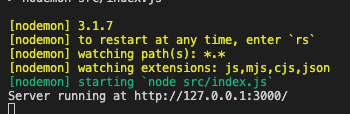
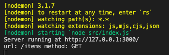
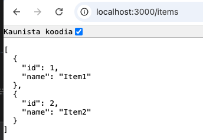
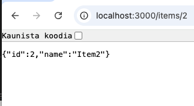
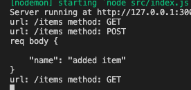
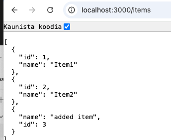

# 1. Tehtävä HTTP METODIT & REST API

- Luodaan palvelin, joka käsittelee HTTP pyyntöjä
- Eri metodeja joita käytetty:
  - GET = hakee koko mock datan sisällön
  - GET ID = hakee mock datan sisällöstä itemin / id numero
  - PUT = lisää uuden itemin mock dataan

## Muutokset

- Korjattu tunnin TODO: check largest id in array and increment by 1 siistimmäksi
- Lisätty GET ID metodi

## SCREENSHOSTS

### Server running

### GET

### GET ID

### POST

