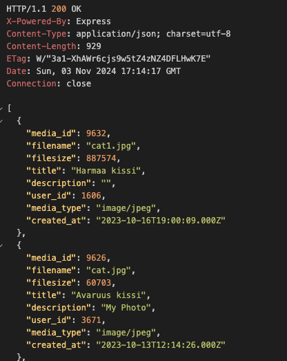
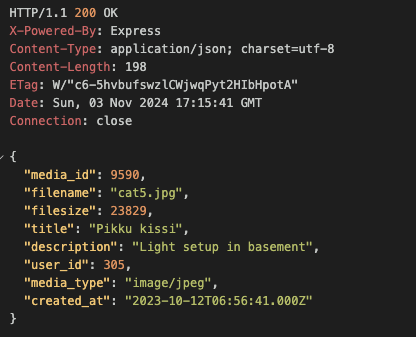
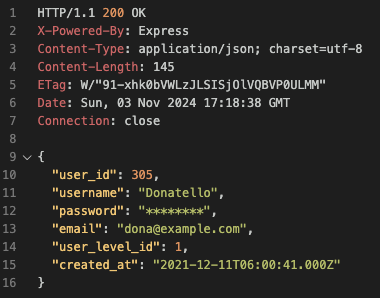
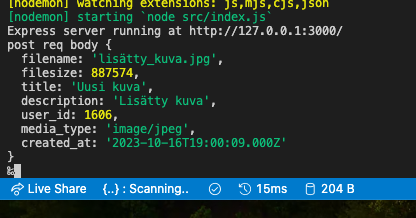
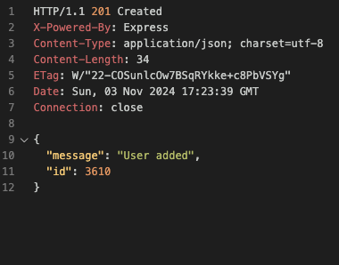
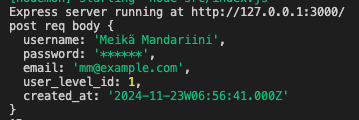
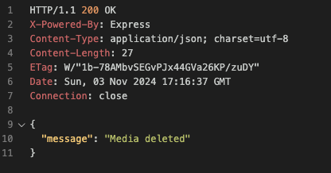
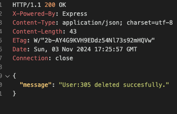
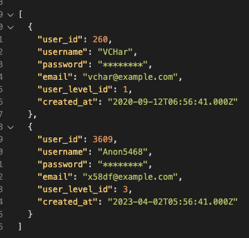
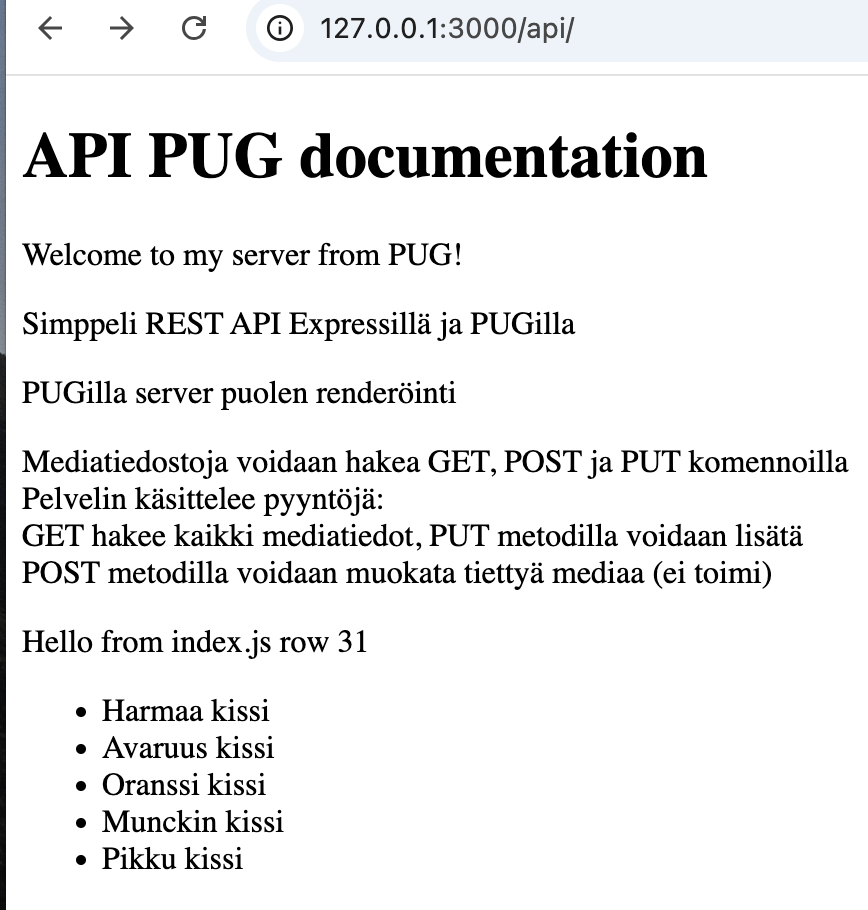

# MediaSharing REST API application

- Luodaan palvelin, joka käsittelee HTTP pyyntöjä
- Eri metodeja joita käytetty:

  - GET = hakee koko mock datan sisällön
  - GET ID = hakee mock datan sisällöstä itemin / id numero
  - POST = lisää uuden median / käyttäjän
  - DELETE = poistaa median / käyttäjän tietyllä ID:llä

- PUGilla renderöidään index

## Asennus

1. Clone
2. Aja `npm install`
3. Luo database
4. Luo .env filu
5. Asenna dotenv

## Mitä tehty ja ongelmat

- Lisätty USERS.js
- Lisätty DELETE metodi media.js ja user.js
- PUT ei toimi

## SCREENSHOSTS

### GET

Get media:

Get user:

### POST

Post media:

Post user:

### DELETE

Delete media:

Delete user

## PUG

Pugilla renderöinti:

